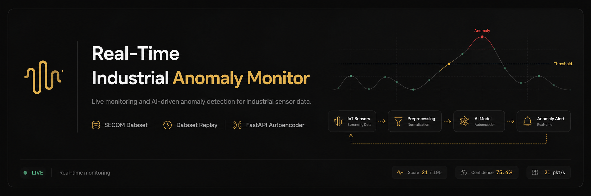
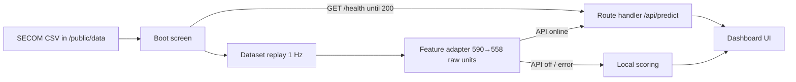

<p align="center">
  
</p>

<h1 align="center">Real-Time Industrial Anomaly Monitor</h1>

<p align="center">
  <strong>Next.js · TypeScript · Tailwind · Recharts · Autoencoder inference on Vercel</strong><br />
  <em>Production-style dashboard that replays SECOM manufacturing data as a live IoT stream and scores anomalies in real time.</em>
</p>

<p align="center">
  <a href="https://github.com/sidnei-almeida/industrial-iot-anomaly-monitor"><strong>View on GitHub</strong></a>
  &nbsp;·&nbsp;
  <a href="https://github.com/sidnei-almeida/secom_failure_prediction">Model training repo</a>
</p>

<p align="center">
  
  
  
  
  
  
  
</p>

---

## What this is

A **minimalist industrial monitoring dashboard** for semiconductor manufacturing anomaly detection. It replays the cleaned **SECOM** dataset (`secom_cleaned_dataset.csv`) as a **simulated real-time IoT sensor stream**—one manufacturing row per second—and visualizes live risk scores, process status, model output, sensor telemetry, and operational events.

Inference runs through a **Neural Network Autoencoder** that executes **inside this deployment**. The trained Keras weights are exported to a compact float32 buffer and evaluated by a pure-TypeScript forward pass in a Next.js route handler (`/api/predict`), so the dashboard has no external inference dependency: no Python service, no cold-start Space, nothing to keep awake. The UI still waits for `/api/health` before entering the dashboard.

> **This is not a live factory PLCs integration.** Data is historical SECOM samples replayed with honest labeling: *Dataset Replay*, *Local Scoring*, and *Autoencoder API* for real model output.

> **Model provenance:** training code, the Keras model, and the scaler parameters live in [secom_failure_prediction](https://github.com/sidnei-almeida/secom_failure_prediction). `scripts/export_model_weights.py` converts them into `src/lib/model/weights.ts`.

---

## Application sections

Single-page shell with a fixed sidebar. All views share the same stream state (`useSecomMonitor`).

| Section | Purpose |
|---------|---------|
| **Dashboard** | KPI strip, live anomaly score chart, sensor telemetry (6 mapped sensors), model inference output, pipeline strip, stream controls |
| **Dataset & Model** | SECOM dataset profile, class distribution, autoencoder flow, inference contract (`POST /predict`), dataset-to-model alignment |
| **Alerts / Event Log** | Live event table, alert history, severity and scoring-source badges |
| **Control Center** | Stream interval, chart window, API preference, anomaly injection, loop/reset, runtime summary |



---

## Main features

### Boot & API wake-up

- Full-screen **boot screen** polls `GET /health` every ~2.5s until HTTP **200**
- Step list: shell → dataset metadata → wake inference → verify health → prepare stream
- Calm messaging after ~20s if the inference route is slow to start; **Retry now** + link to health URL
- Dashboard **does not render** until the API responds (no broken empty state on deploy)

### Live operations dashboard

- **Start / Pause / Reset / Inject Anomaly** stream controls
- **Inject Anomaly** pulls a real `Pass/Fail = 1` row from the dataset (no synthetic failure fabrication)
- **KPI cards** — packet count, live score, process status, stream/API indicators
- **Live Anomaly Score** — Recharts area chart, threshold at display score 60, theme-aware colors
- **Sensor Telemetry** — Chamber Pressure, Etch Rate, RF Power, Wafer Temperature, Gas Flow, Vacuum Level (columns 0–5)
- **Model Inference Output** — reconstruction error, display score, confidence, ground truth, inference mode, recommended action
- **Pipeline strip** — SECOM Dataset → Replay Stream → Scoring → Threshold → Dashboard Alert

### Dataset & model analytics

- Dataset stats: **1,567** rows, **590** sensor columns, class imbalance (~93% normal / ~7% failure)
- **Class distribution** bar chart (Normal vs Failure)
- **How the Model Works** — encoder/decoder flow and reconstruction-error explanation
- **Inference contract** — documented request/response for `POST /predict`
- Alignment table: CSV features vs **558** model inputs, adapter strategy, current dashboard mode

### Alerts & control

- Scrollable **event log** with severity, source badge (`API` / `Local`), timestamps, recommended actions
- **Alert history** for critical/warning episodes
- **Control Center** — stream speed (0.5s / 1s / 2s), chart window (30 / 60 / 120 points), optional API-first toggle, auto-inject cadence, dataset loop

### Scoring modes (terminology)

| UI label | Meaning |
|----------|---------|
| **SECOM Cleaned Dataset** | Static CSV replay source (`public/data/secom_cleaned_dataset.csv`) |
| **Dataset Replay** | One row per tick as a simulated IoT packet |
| **Local Scoring** | Heuristic score from pass/fail context when API is off or after API error on a packet |
| **Autoencoder API** | Live `reconstruction_error` + `is_anomaly` from `/api/predict` |

When API mode is enabled and a request fails mid-stream, scoring falls back to local rules for that packet; the UI still shows **Local** (amber badge), not a separate “fallback” product mode.

---

## Design system

Built for long monitoring sessions: **piano black / piano white**, restrained gold accents, no neon UI.

| Element | Implementation |
|---------|----------------|
| **Themes** | `data-theme="dark"` (default) and `data-theme="light"` with toggle in top bar and boot screen |
| **Typography** | [DM Sans](https://fonts.google.com/specimen/DM+Sans) (UI) + [DM Mono](https://fonts.google.com/specimen/DM+Mono) (metrics, tables, code) via `next/font` |
| **Surfaces** | `--bg-page`, `--bg-card`, subtle `--line` borders (no harsh white outlines in dark mode) |
| **Accent** | Gold (`--gold`) for active nav, thresholds, live emphasis; green/red for normal/anomaly states |
| **Charts** | Recharts with `useChartTheme` reading CSS variables; smooth updates, no cartoon motion |
| **Brand** | Lucide **AudioWaveform** mark — favicon, OG image, sidebar logo (`src/components/brand/`) |

Tokens: `src/app/globals.css` · chart colors: `src/lib/monitor-theme.ts`

---

## SECOM dataset & model

| Item | Value |
|------|--------|
| Rows | 1,567 manufacturing samples |
| CSV columns | `Time` + sensors `0`–`589` (590) + `Pass/Fail` |
| Pass/Fail | `-1` = Normal · `1` = Failure |
| Model input | **558** features — CSV columns with ≤20% missing values in the original SECOM release, rescaled from the CSV's `[0,1]` normalization back to raw sensor units |
| Default threshold | `0.45` reconstruction error |
| Display alert line | **60** on 0–100 risk scale |
| Warning band | 50–59 |
| Display scale anchors | error `0.30` → 0 · `0.45` → 60 · `0.75` → 100 |

Autoencoder architecture: 558 → 128 → 64 → 32 (bottleneck) → 64 → 128 → 558 — trained on normal samples; anomaly = high reconstruction error (MAE).

**Display scale.** The reconstruction error never approaches 0 — over the replay dataset it runs from ~0.16 to ~1.8, clustered around 0.37 — so mapping it linearly from zero would waste the bottom of the 0–100 scale and park the median sample on the warning line. The score is anchored on the observed distribution instead: p5 of the errors reads as 0, the threshold reads as 60, p99 reads as 100. Anomaly decisions still compare the raw error against `0.45`, and the UI shows both numbers side by side. Re-derive the anchors with `scripts/calibrate_display_scale.py` if the model is retrained.

The replay CSV keeps all 590 columns, imputed and min-max normalized for the sensor gauges, while the model expects the 558 cleaned columns in raw units. `src/lib/feature-adapter.ts` bridges the two; `scripts/export_feature_space.py` derives the column selection and the per-column bounds from the original UCI SECOM release.

---

## Tech stack

| Layer | Choice |
|-------|--------|
| Framework | Next.js 16 (App Router) |
| Language | TypeScript |
| Styling | Tailwind CSS v4 + CSS variables |
| Components | shadcn/ui + Radix |
| Charts | Recharts 3 |
| Icons | Lucide React |
| CSV | PapaParse |
| Data / state | Client hooks (`useSecomMonitor`, `useApiWakeup`, `useChartTheme`) |

---

## Environment

No environment variables are required — the model ships with the app. To override defaults, create `.env.local`:

```env
# Model scoring (default on; set false for local-only demo)
NEXT_PUBLIC_USE_SECOM_API=true

# Optional: production site URL for Open Graph metadata
# NEXT_PUBLIC_SITE_URL=https://your-app.vercel.app

# Optional: point the dashboard at an external service that speaks the same
# /health and /predict contract. Defaults to this app's own /api routes.
# NEXT_PUBLIC_SECOM_API_URL=https://example.com
```

| Variable | Purpose |
|----------|---------|
| `NEXT_PUBLIC_SECOM_API_URL` | Base URL for `/health` and `/predict`. Defaults to `/api` (this deployment) |
| `NEXT_PUBLIC_USE_SECOM_API` | When not `false`, app scores with the model; otherwise local scoring only |
| `NEXT_PUBLIC_SITE_URL` | Canonical URL for social preview metadata |

---

## Quick start

```bash
git clone https://github.com/sidnei-almeida/industrial-iot-anomaly-monitor.git
cd industrial-iot-anomaly-monitor

npm install
npm run dev
```

Open [http://localhost:3000](http://localhost:3000).

> **Note:** The first `/api/health` response decodes the model weights (~650 KB) and takes a few hundred milliseconds; every request after that reuses the decoded buffers. The boot screen polls until the route answers.

### Production build

```bash
npm run build
npm start
```

### Lint

```bash
npm run lint
```

---

## Deploy on Vercel

1. Import this repository on [Vercel](https://vercel.com).
2. **Framework preset:** Next.js  
3. **Root directory:** repository root (not a subfolder).
4. **Environment variables:** none are required — inference ships with the app.
   - `NEXT_PUBLIC_SITE_URL` = your production URL (recommended, for social previews)
   - `NEXT_PUBLIC_USE_SECOM_API` = `false` to disable model scoring and run local scoring only
5. Deploy.

**Project icon / OG:** static assets in `public/brand/`; Next.js also generates `/icon`, `/apple-icon`, and `/opengraph-image` at build time.

---

## Repository structure

```
industrial-iot-anomaly-monitor/
├── images/
│   └── header.png              # README hero banner
├── public/
│   ├── brand/                  # Logo kit (favicon, OG, mark SVGs)
│   └── data/
│       └── secom_cleaned_dataset.csv
├── src/
│   ├── app/                    # layout, page, globals, icon, opengraph-image
│   ├── components/
│   │   ├── brand/              # BrandMark (AudioWaveform)
│   │   ├── dashboard/          # AppShell, sections, charts, panels
│   │   └── ui/                 # shadcn primitives
│   ├── hooks/                  # useSecomMonitor, useApiWakeup, useTheme, …
│   ├── lib/                    # API client, stream, scoring, adapter, theme
│   └── types/                  # SECOM / stream TypeScript types
├── .env.example
├── readme_model.md             # README style reference
└── package.json
```

---

## API surface used by the UI

| Endpoint | Method | Role |
|----------|--------|------|
| `/api/health` | GET | Boot gate + runtime status (`{"status":"ok"}`) |
| `/api/predict` | POST | Autoencoder inference per sensor packet (up to 32 samples) |
| `/api/predict` | GET | Model metadata: threshold, test-set metrics, feature count |

**`POST /predict` body (simplified):**

```json
{
  "instances": [[ "...558 numeric features..." ]],
  "threshold": 0.45
}
```

**Response (simplified):**

```json
{
  "threshold": 0.45,
  "predictions": [
    {
      "reconstruction_error": 0.38,
      "is_anomaly": false
    }
  ]
}
```

Training details and the original Python service: [secom_failure_prediction README](https://github.com/sidnei-almeida/secom_failure_prediction).

---

## Key modules

| Module | Responsibility |
|--------|----------------|
| `src/lib/secom-data.ts` | Load & parse CSV |
| `src/lib/secom-stream.ts` | Build stream packets; API vs local scoring |
| `src/lib/secom-api.ts` | Health check + predict client |
| `src/app/api/predict/route.ts` | Inference endpoint (Node runtime) |
| `src/lib/model/autoencoder.ts` | TypeScript forward pass + scaler |
| `src/lib/model/weights.ts` | Generated weights (base64 float32) |
| `src/lib/feature-adapter.ts` | 590 → 558 mapping + rescale to raw units |
| `src/lib/anomaly-scoring.ts` | Display score, process status, local scoring |
| `src/hooks/use-secom-monitor.ts` | Stream loop, events, chart buffer, controls |
| `src/hooks/use-api-wakeup.ts` | Boot screen polling & step state |

---

## Related repositories

| Project | Role |
|---------|------|
| [secom_failure_prediction](https://github.com/sidnei-almeida/secom_failure_prediction) | Model training, Keras weights, scaler parameters, original FastAPI service |
| **This repo** | Next.js monitoring dashboard & SECOM replay UI |

---

## Disclaimer

This application is a **portfolio demonstration**. It replays a cleaned historical SECOM dataset as a simulated stream; it is not connected to real factory equipment. Model scores and UI states are for **monitoring workflow illustration only**—not investment advice, safety certification, or production release guidance. Validate any deployment against your own MLOps and operational requirements.

---

## Author

**Sidnei Alves de Almeida** — [@sidnei-almeida](https://github.com/sidnei-almeida)
